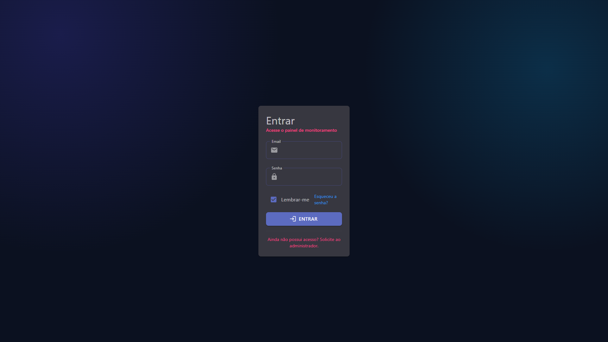
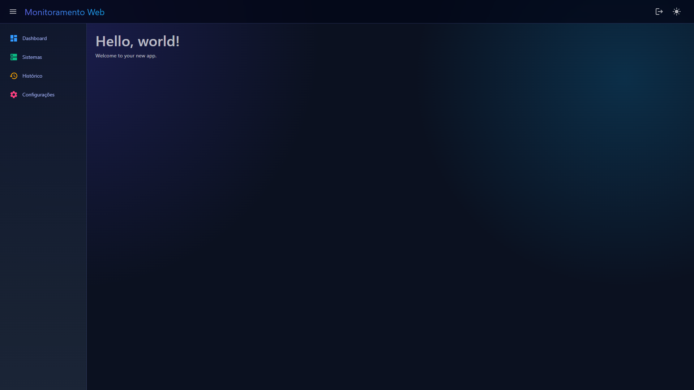
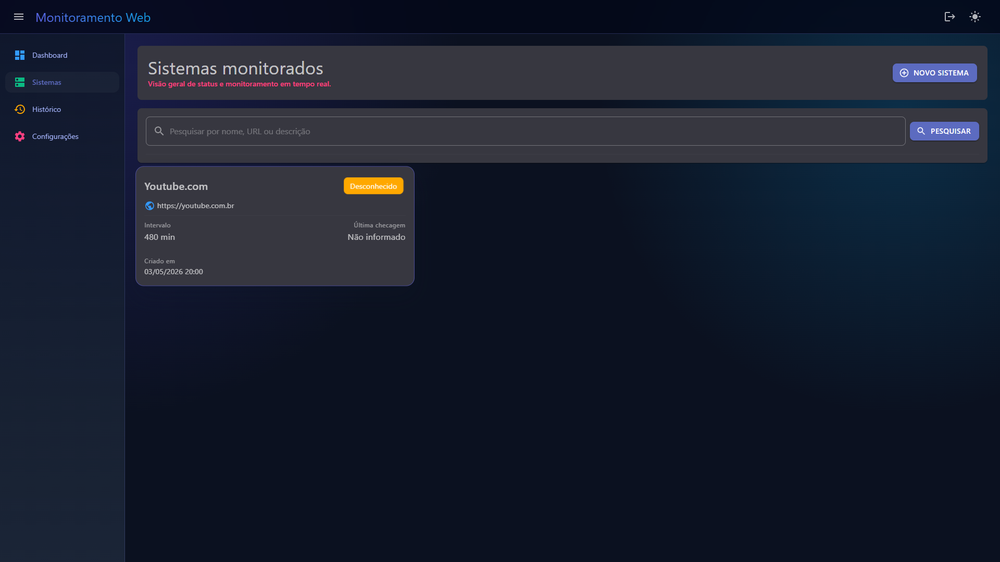
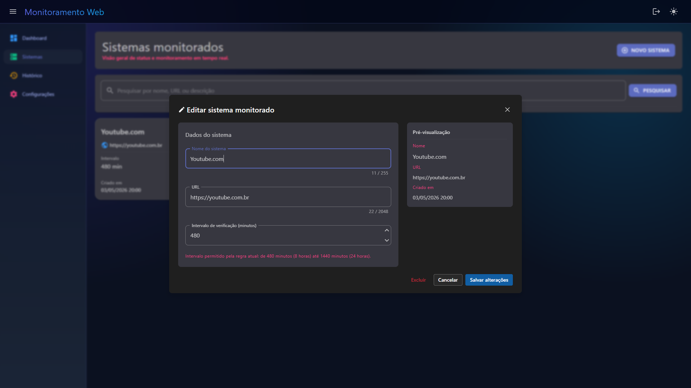

# 🚀 HealthCheck Monitor

  <b>Monitoramento inteligente de serviços com foco em confiabilidade, clareza e evolução contínua.</b> 
  <i>Aplicação web em Blazor Server, construída em .NET 10</i>

---

## ✨ Visão Geral

O `HealthCheck Monitor` é um sistema web criado para registrar sistemas (atualmente endpoints HTTP) e acompanhar sua disponibilidade com base em intervalos configuráveis.

🎯 **Objetivo principal:** oferecer uma base sólida para observabilidade operacional, destacando rapidamente quando um serviço está saudável, indisponível ou com status desconhecido.

---

## 🧠 Proposta do Produto

Com o sistema, é possível:

- 📝 Registrar sistemas a serem monitorados
- ⏱️ Definir o intervalo de verificação
- 📊 Acompanhar status de saúde dos sistemas cadastrados
- ⚠️ Preparar terreno para notificações automáticas em falhas

> 🔔 **Próxima evolução planejada:** camada de notificação (e-mail/outros canais) quando houver indisponibilidade ou incerteza de status.

---

## 🖼️ Telas do Projeto

  

  

  

  

## 🏗️ Arquitetura da Solução

O projeto está organizado em três camadas/projetos principais:

- 🌐 `HealthCheck.Web`  
  Interface web em `Blazor Server`, responsável pela experiência do usuário e fluxo de uso.

- 🧩 `HealthCheck.Domain` (`HealthCheck.Framework.csproj`)  
  Núcleo de regras de negócio, serviços e contratos de acesso a dados.

- 🛠️ `HealthCheck.DbUp`  
  Projeto utilitário para preparação inicial do banco de dados.

Essa divisão favorece **manutenção**, **evolução incremental** e **separação de responsabilidades**.

---

## ⚙️ Stack Técnica (visão geral)

- `.NET 10` para a base da aplicação
- `Blazor Server` para a interface web
- `PostgreSQL` como banco de dados
- `Dapper` para acesso a dados
- `FluentValidation` para validações
- `MudBlazor` e `Syncfusion Blazor` para a experiência visual
- Autenticação com cookies do Microsoft ASP.NET

---

## 🔐 Autenticação (visão geral)

- ✅ Autenticação baseada em cookies do **Microsoft ASP.NET**
- ✅ Sessão com expiração configurável
- ✅ Login e logout centralizados via endpoints internos

---

## 🧭 Status Atual do Projeto

### ✅ Já implementado
- Estrutura da aplicação web
- Cadastro e gerenciamento de sistemas monitorados
- Persistência de dados
- Base de validações
- Camada de feedback visual para o usuário
- Fluxo de autenticação e sessão com cookies

### 🔄 Em evolução
- Execução automática recorrente das verificações
- Notificações de incidentes
- Recursos avançados de histórico e filtros

---

## 🔐 Aviso Importante de Uso

🚫 **Este projeto NÃO possui licença de uso aberta.**  
Todos os direitos estão reservados ao autor.

**Não é permitido usar, copiar, modificar, distribuir ou reutilizar este código sem autorização explícita.**

---

## 👨‍💻 Autor

Projeto desenvolvido por **Daniel Vieira Fernandes**.

  Feito com dedicação, visão de produto e foco em excelência técnica. ✨

