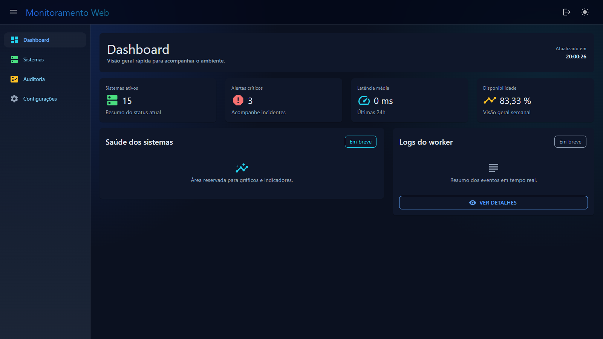
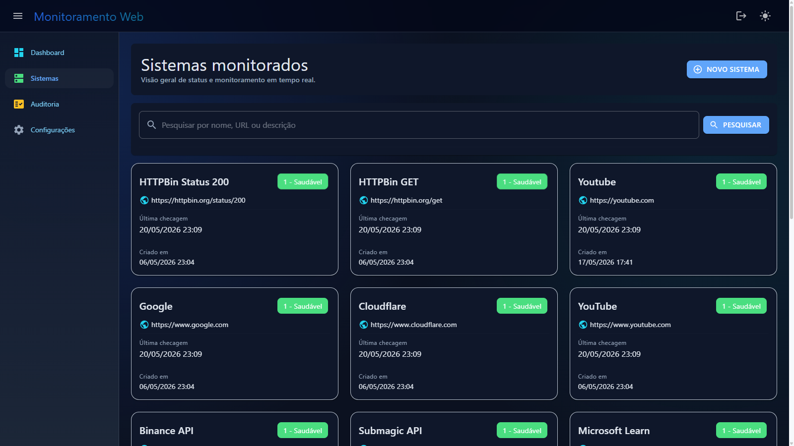
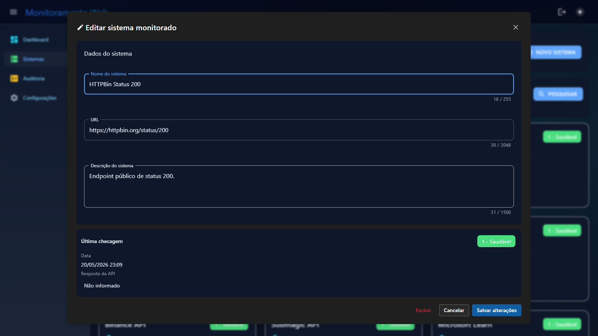
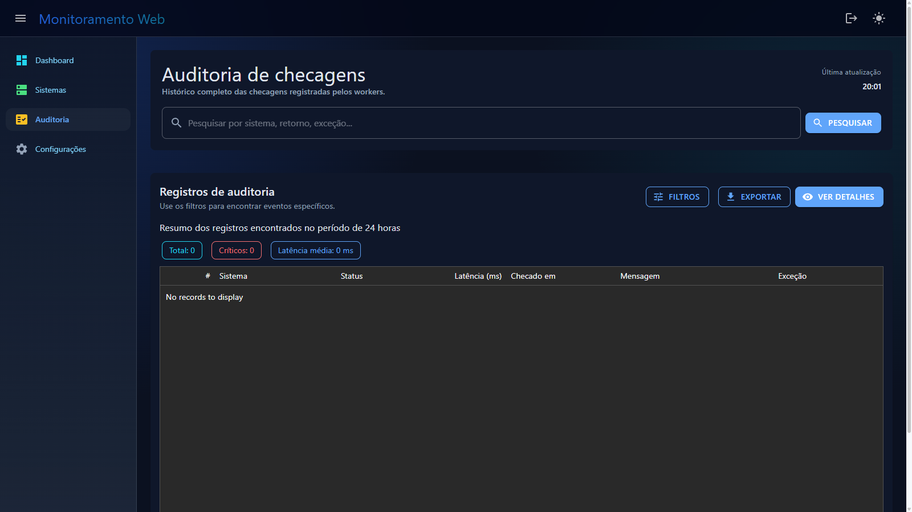
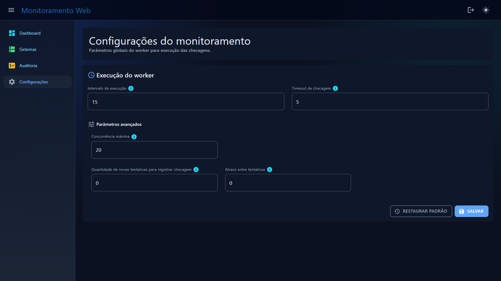

# 🚀 HealthCheck Monitor

  <b>Monitoramento inteligente de serviços com foco em confiabilidade, clareza e evolução contínua.</b> 
  <i>Aplicação web em Blazor Server, construída em .NET 10</i>

---

## ✨ Visão Geral

O `HealthCheck Monitor` é um sistema web criado para registrar sistemas (atualmente endpoints HTTP) e acompanhar sua disponibilidade com base em intervalos configuráveis.

🎯 **Objetivo principal:** oferecer uma base sólida para observabilidade operacional, destacando rapidamente quando um serviço está saudável, indisponível ou com status desconhecido.

---

## 🧠 Proposta do Produto

Com o sistema, é possível:

- 📝 Registrar sistemas a serem monitorados
- ⏱️ Definir parâmetros globais de monitoramento no worker
- 📊 Acompanhar status de saúde, latência e histórico das checagens
- 🔐 Controlar acesso por autenticação com cookies
- 🧩 Centralizar a leitura do dashboard, auditoria, configurações e manutenção dos sistemas

> 🔔 **Evoluções já incorporadas:** execução recorrente em background, auditoria das checagens, configurações persistidas e atualização automática do painel principal.

---

## 🖼️ Telas do Projeto

  

  

  

  

  

## 🏗️ Arquitetura da Solução

O projeto está organizado em quatro projetos principais:

- 🌐 `HealthCheck.Web`  
	Interface web em `Blazor Server`, responsável pela experiência do usuário, autenticação e navegação entre dashboard, auditoria, configurações e sistemas monitorados.

- 🧩 `HealthCheck.Framework`  
  Núcleo compartilhado com modelos, validações, repositórios, serviços de banco e utilitários da solução.

- ⚙️ `HealthCheck.Worker`  
  Serviço em segundo plano responsável por executar o monitoramento recorrente e a limpeza de registros antigos.

- 🛠️ `HealthCheck.DbUp`  
  Projeto utilitário para preparação e evolução inicial do banco de dados.

Essa divisão favorece **manutenção**, **evolução incremental**, **separação de responsabilidades** e **execução assíncrona do monitoramento**.

---

## ⚙️ Stack Técnica (visão geral)

- `.NET 10` para a base da aplicação
- `Blazor Server` para a interface web
- `Worker Service` para monitoramento em background
- `PostgreSQL` como banco de dados
- `Dapper` para acesso a dados
- `FluentValidation` para validações
- `MudBlazor` e `Syncfusion Blazor` para a experiência visual
- Autenticação com cookies do Microsoft ASP.NET
- Atualização periódica do dashboard e auditoria de checagens

---

## 🔐 Autenticação (visão geral)

- ✅ Autenticação baseada em cookies do **Microsoft ASP.NET**
- ✅ Sessão com expiração configurável
- ✅ Login e logout centralizados via endpoints internos
- ✅ Controle de acesso nas páginas principais da aplicação

---

## 🧭 Status Atual do Projeto

### ✅ Já implementado
- Estrutura completa da aplicação web em Blazor Server
- Cadastro, edição, exclusão e pesquisa de sistemas monitorados
- Dashboard com indicadores de disponibilidade, alertas e latência média
- Auditoria com filtros, detalhamento e visão de histórico das checagens
- Tela de configurações do worker com persistência dos parâmetros de execução
- Worker em background com execução recorrente, atualização dinâmica de configuração e limpeza de dados antigos
- Persistência de dados e repositórios centralizados no projeto compartilhado
- Base de validações e feedback visual para o usuário
- Fluxo de autenticação e sessão com cookies

### 🔄 Em evolução
- Evolução das visualizações do dashboard com gráficos e indicadores adicionais
- Expansão dos recursos de auditoria e análise operacional
- Camada futura de notificações para indisponibilidades e eventos críticos
- Aprimoramentos de observabilidade e experiência de uso

---

## 🔐 Aviso Importante de Uso

🚫 **Este projeto NÃO possui licença de uso aberta.**  
Todos os direitos estão reservados ao autor.

**Não é permitido usar, copiar, modificar, distribuir ou reutilizar este código sem autorização explícita.**

---

## 📚 Documentação

A documentação completa está em [`docs/`](docs/Home.md):

| Seção | Conteúdo |
|---|---|
| [Domínio](docs/Domain-Overview.md) | Conceitos, regras de negócio, personas |
| [Arquitetura](docs/Architecture-Overview.md) | C4 Model, containers, componentes |
| [ADR](docs/ADR-001-Dapper.md) | Decisões de arquitetura registradas |
| [Desenvolvimento](docs/Development-Setup.md) | Setup, estrutura, convenções, testes |

---

## 👨‍💻 Autor

Projeto desenvolvido por **Daniel Vieira Fernandes**.

  Feito com dedicação, visão de produto e foco em excelência técnica. ✨

